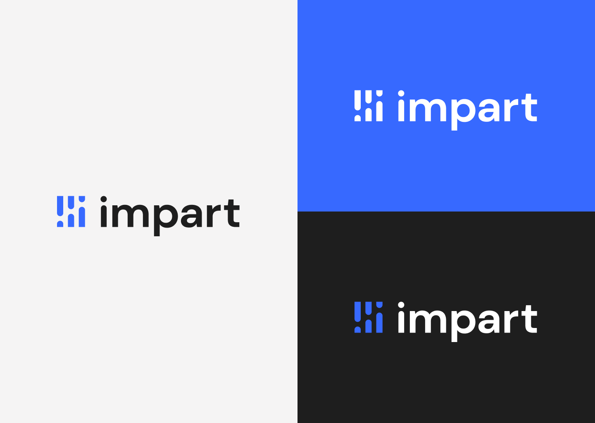
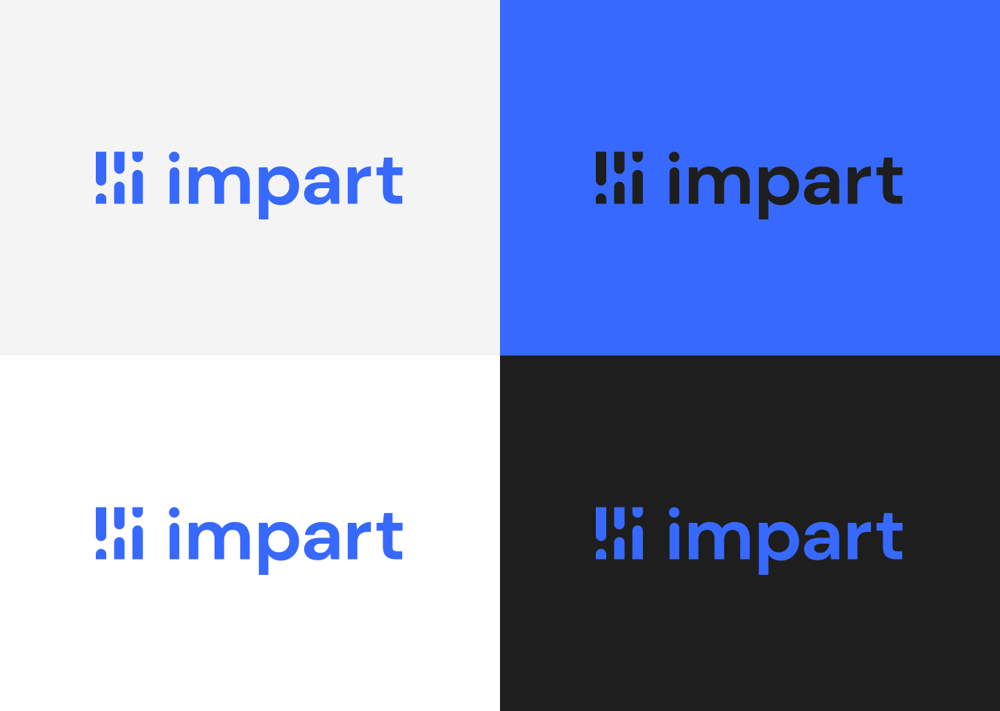
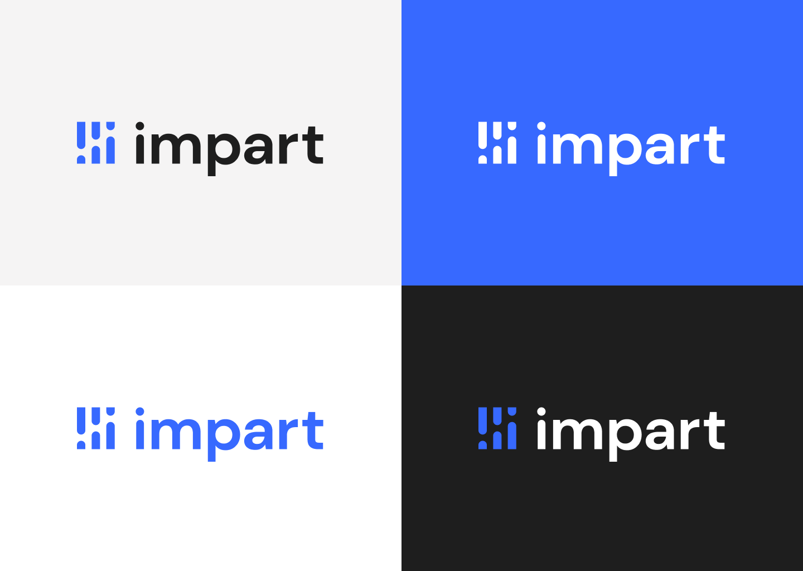
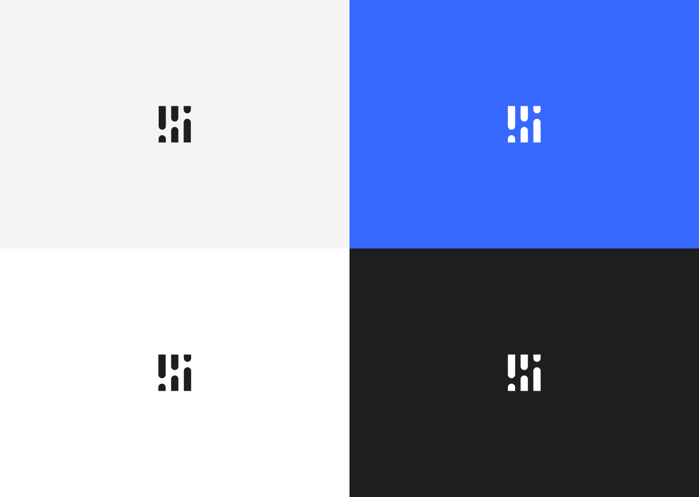
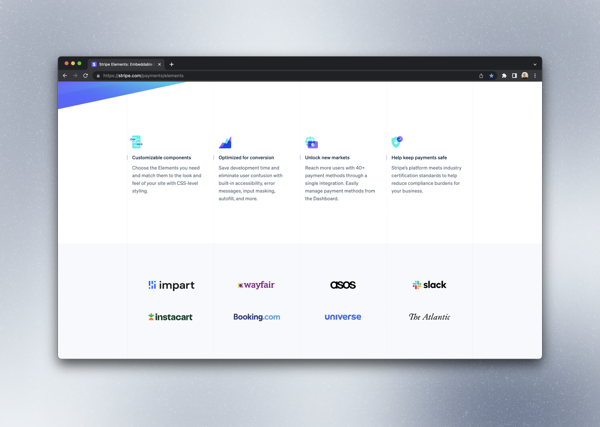
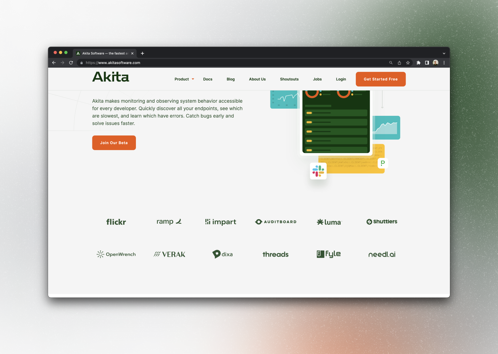

# Throwing my hat in the ring

Shortly after joining Impart Security, leadership decided to rebrand. An external agency was hired to redesign the logo. I was present for a few of their presentations, and while the design was competent and met the brief, the internal reception was lukewarm.

I took it upon myself to explore some refinements that made the design feel more modern and related to our business. The team ultimately adopted my version, and it is now the official logo for Impart Security.

# Presentation

The following images are the slides I presented to the team, accompanied by my approximate commentary.

---

## Destination first (spoiler alert!)

### Overview

Let's start with the end result. This is how I envision the logo looking, and how it could exist within the brand color scheme.

### Dark and light

On the left, we have light gray and white backgrounds with solid color dark logos. On the right, our brand blue and black backgrounds with white logos. The logo is designed to be flexible and work in a variety of contexts.

### Brand

These images show the logo as a solid fill of our brand blue, on the same backgrounds as before.

### Mixed

Here we have a mixture of solid/mixed fill logos on various backgrounds. The logomark and text remain legible and recognizable in all cases. We don't sacrifice clarity for style.

### Logomark

To further illustrate the flexibility of the logo, here are some examples of the logomark on its own. The logomark is designed to be recognizable and legible even at small sizes.

## Agency design analysis

### Dark and light — Agency, two-tone

Finally, here are some examples of the agency logo design. We were never provided with a presentation like this, but I recreated the logo and displayed it in a comparble format so that we could have an informed discussion.

The agency version was a two-tone design. I included some rather illegible examples to illustrate the shortcomings of including a second color within the single graphic element. In the light background cases, the subtle blue/black contrast in the logomark is difficult to discern. In the dark background cases, the dots are lost in the background color, leaving the logomark looking quite different than the light background cases.

.png>)

### Dark and light — Agency, monochrome

To have an honest comparison in good faith, I created a monochrome version of the agency logo design. This version is more legible than the two-tone version, but it still suffers from other aesthetic pitfalls (discussed later).

.png>)

### Brand — Agency, monochrome

Here are the brand-fill versions of the agency logo design.

.png>)

## Side-by-side comparison

### Logo comparison — Internal, left vs. agency, right

It is worth noting that the agency had been instructed to use this specific shade of blue. In my explorations I allowed myself to explore a more vibrant, lively shade of blue that I felt better expressed our brand.

### Logomark comparison — Internal, left vs. agency, right

The main issues that I identified with the agency design were:

- The brief was to include three of something, to represent our three founders. We were moving away from a triangle logo. The agency's solution was to use the lowercase letter "i" (for Impart) three times, stacked horizontally on their side.
- The i's are too literal, and look like just that: three lowercase i's.
- The horizontal i's almost look like people stacked in a bunk bed.
- The rounded letterforms don't correspond to the precision, accuracy, and professionalism that we want to convey in our brand.

My solution addresses all of these issues:

- Turning the i's upright allows the logomark to be more literal (the i's are in their natural orientation) as well as more abstract (the i's are now a geometric shape that could be interpreted as a chart).
- The bars of the new logomark don't look like people.
- The angular edges allow the logo to fit in a tidy, sharp box without requiring a literal bounding container.

## In context

Here are some examples of the logo in context, so we can evaluate how it looks in real-world applications.

### GitHub

### Twitter

### Stripe

### Akita

## In our console

Product screenshots!

### Impart light

### Impart dark

